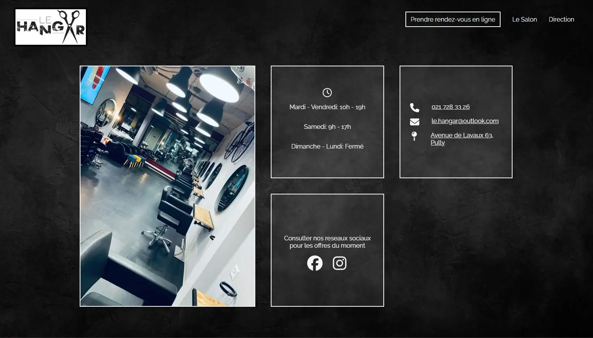

# Le Hangar Pully - A real Hair salon's website 

This is version 2 of the repository for an actual website made for a friend who owns a hair salon: [https://www.lehangarpully.ch/](https://www.lehangarpully.ch/)

The website had to be dark and industrial, responsive, and simple.

It contains links for booking and everything one would need to access the salon easily.

GitHub Link to Version 1 (Discontinued): [https://github.com/DylanNicolet/le-hangar-pully](https://github.com/DylanNicolet/le-hangar-pully)

## Tech Used

- **Framework**: [React](https://reactjs.org/) with Vite  
- **Styling**: SCSS  
- **Deployment**: Netlify